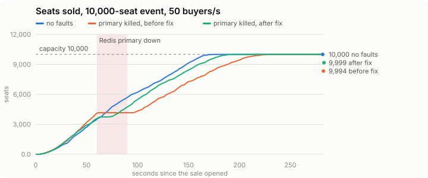
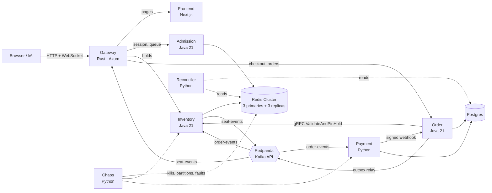

# Surge

[](https://github.com/DAmin05/Surge/actions/workflows/ci.yml)

A flash-sale ticketing system built to survive the herd **without ever overselling**: a
waiting room, live seat map, seat holds, a checkout saga with payments, and a chaos suite
that tries to break it while a reconciler proves it didn't.

**10,000 seats sold out in 174 seconds, 0 oversold** — then the same sale with a Redis
primary killed at peak, still 0 oversold and no stall
([headline results](docs/results/week6-headline.md)).



## Contents

- [The one guarantee](#the-one-guarantee)
- [Architecture](#architecture)
- [How a purchase works](#how-a-purchase-works)
- [Quick start](#quick-start)
- [Using it](#using-it)
- [Testing](#testing)
- [Load, chaos and the headline test](#load-chaos-and-the-headline-test)
- [Observability](#observability)
- [Configuration](#configuration)
- [Every `make` target](#every-make-target)
- [Troubleshooting](#troubleshooting)
- [Repository layout](#repository-layout)
- [Documentation](#documentation)
- [Roadmap](#roadmap)

## The one guarantee

**A seat is sold at most once, and nobody is charged for a seat they don't get.**

Redis holds are the *performance* layer; Postgres is the *correctness* layer. Redis
Cluster replicates asynchronously, so a failover can lose an acknowledged hold and two
buyers can both believe they hold the same seat. The checkout therefore ends in a
conditional multi-row claim in Postgres (`UPDATE seats … WHERE status = 'AVAILABLE'`,
all-or-nothing, in a fixed lock order), backed by a unique constraint on
`tickets.seat_id`. Exactly one buyer wins; the loser's hold is released and their payment
is never taken — or refunded, if a late success arrives after the seat went to someone
else. → [ADR 0001](docs/adr/0001-postgres-is-the-source-of-truth.md)

Seven invariants are checked continuously by the Reconciler and must be 0 after every
test run: sold ≤ capacity, no seat sold twice, every captured payment has all its tickets
or a refund, no order stuck past the payment timeout, no zombie holds, ≤ 4 seats per
buyer, order amounts equal their line items.

## Architecture



| Service | Language | Owns |
|---|---|---|
| **gateway** | Rust (Axum, Tokio) | Single public entry point: token verification, per-IP/per-user rate limits, API proxy, WebSocket seat-map fan-out, serves the frontend |
| **admission** | Java 21 / Spring Boot | Anonymous session identity, waiting room, admission tokens (Ed25519) |
| **inventory** | Java 21 / Spring Boot | Seat holds in Redis (Lua), hold sweeper, seat events, sold-set rebuild |
| **order** | Java 21 / Spring Boot | Checkout, the Postgres seat claim, the saga, transactional outbox, idempotency keys |
| **payment** | Python / FastAPI | Mock payment gateway with fault injection, signed webhooks, refunds |
| **reconciler** | Python | The seven invariants, continuously and on demand |
| **chaos** | Python | Fault controller: Docker SDK + Toxiproxy + Payment faults |
| **frontend** | Next.js / TypeScript | Buyer flow, live seat map, war room, chaos panel |

Infrastructure: Redis Cluster (6 nodes), Postgres 16 (one schema and role set per
service, Flyway migrations), Redpanda, Toxiproxy, Prometheus, Grafana, Jaeger. All of it
runs from one `docker compose up`.

## How a purchase works

1. **Session.** The browser gets an anonymous identity in an HttpOnly cookie.
2. **Waiting room.** It joins the event's queue. Admission lets buyers in at a fixed
   rate per event and hands each an admission token bound to the event and the buyer.
3. **Live map.** The seat map comes over a WebSocket: a snapshot, then every seat change
   in order (`epoch`, `seq` per section). A gap or an epoch change triggers a re-snapshot,
   so the map can miss an event but can't stay wrong.
   → [ADR 0004](docs/adr/0004-seat-events-without-outbox.md), [ADR 0006](docs/adr/0006-gateway-consumes-every-partition.md)
4. **Hold.** The buyer holds 1–4 seats in one section. One Lua script on one Redis slot
   holds all of them or none, for a 5-minute lease.
5. **Checkout** with an `Idempotency-Key`. Order pins the hold over gRPC (extending it past
   the payment timeout plus a grace), then claims the seats in Postgres and writes
   `PaymentRequested` to the outbox in the same transaction. A retried request with the
   same key replays the same order.
6. **Payment.** The outbox relay publishes to Kafka; Payment charges and calls Order back
   with an HMAC-signed webhook, which is authoritative. Success issues tickets and marks
   the seats sold; failure or timeout releases them. A late success after release is
   refunded. → [ADR 0005](docs/adr/0005-orchestrated-saga.md)
7. **Sold.** Inventory records the sale on a compacted topic, writes sold markers, and
   every browser watching the event sees the seat go gray.

The full spec, including every status code and edge case, is in
[`docs/design.md`](docs/design.md).

## Quick start

**Needs:** Docker with Compose v2 (Docker Desktop: give it at least 8 GB of RAM) and
`make`. About 25 containers start; the first build takes a few minutes.

```bash
git clone https://github.com/DAmin05/Surge.git && cd Surge
make up        # build every image, start the stack, wait until everything is healthy
make seed      # create an event: 10 sections × 20 rows × 50 seats (prints its id)
make smoke     # end-to-end check: hold race on the cluster, checkout, saga, seat events
```

Then open **http://localhost:8080**, pick the event, and buy a seat. Open the same event
in a second window to watch the seat change live.

Stop with `make down` (keeps data) or `make nuke` (deletes all data volumes).
Token signing keys are generated once into `secrets/` (gitignored) on the first `up`, or
with `make keys`.

## Using it

| What | Where |
|---|---|
| **Web app**: events, buyer flow, live seat map | http://localhost:8080 |
| **War room**: invariant violations, saga states, latency, throughput, chaos bands | http://localhost:8080/war-room |
| **Chaos panel**: break things on purpose | http://localhost:8080/chaos |
| Jaeger (traces) | http://localhost:16686 |
| Grafana | http://localhost:3001 |
| Prometheus | http://localhost:9090 |
| Chaos controller API | http://localhost:8002 |
| Postgres | `localhost:5432`, database `surge` |
| Redpanda (Kafka API) | `localhost:19092` |

Handy commands against a running stack:

```bash
make audit                                   # run all seven invariants now
make faults SET='{"failure_rate":0.4}'       # make Payment decline 40 % of charges
make faults SET='{}'                         # back to normal
make logs S=order                            # follow one service's logs
make ps                                      # status of every container
```

## Testing

### Unit and integration tests

```bash
make test            # everything below
make test-java       # Gradle build + JUnit; integration tests use Testcontainers (needs Docker)
make test-rust       # gateway: cargo fmt --check, clippy -D warnings, tests
make test-python     # payment, reconciler, chaos: ruff + pytest (uses uv)
make test-frontend   # Next.js: typecheck + vitest
```

Local toolchains for `make test`: JDK 21 (Gradle wrapper included), Rust stable, `uv`
(Python 3.12), Node 22. Every JVM dependency version lives in
`gradle/libs.versions.toml`.

### End-to-end against the running stack

`make e2e` runs Playwright from `frontend/`: install once with
`cd frontend && npm ci && npx playwright install chromium`.

| Command | What it proves |
|---|---|
| `make check` | Every service healthy, every one-shot job (migrations, cluster init, topics, keys) exited 0 |
| `make smoke` | 50 buyers race for one seat on the real Redis Cluster; checkout over gRPC and Postgres; saga to `CONFIRMED`; seat events in sequence; the gateway buyer path |
| `make e2e` | Playwright: a buyer completes a purchase in the browser while a second browser sees the seat go held, then sold; then one trace spans gateway, order, inventory and payment |
| `make saga-storm` | Buyers against a faulty Payment (declines, stalls past the timeout, duplicate and out-of-order callbacks), with checkout retries: every order terminal, 0 violations. Start the stack with `PAYMENT_TIMEOUT=PT10S PIN_GRACE=PT10S` |

### The exit criteria (all required CI checks)

Each roadmap week shipped as one PR whose exit criterion is a CI job:

| CI check | Criterion | Run locally |
|---|---|---|
| `Exit: stack healthy` | `docker compose up` brings everything healthy; smoke passes | `make up && make smoke` |
| `Exit: one seat, one winner` | 1,000 virtual threads race for one seat: exactly one winner, in Redis and in Postgres | `./gradlew :services:order:test --tests '*ClaimRaceTest'` |
| `Exit: saga survives retries and faults` | The same checkout retried 100× makes one order; injected payment faults all end terminal with 0 violations | `make saga-storm` (short timings) |
| `Exit: WebSocket fan-out p99 < 200 ms` | 5,000 clients (CI) / 10,000 (locally) get every seat update, p99 < 200 ms | `make up-fanout && BENCH_CLIENTS=5000 make ws-bench` |
| `Exit: browser purchase, one trace` | Full buyer flow in the browser; one trace spans all services | `make e2e` |
| `Exit: 20 chaos runs, 0 violations` | 20 chaos runs under load, 0 invariant violations | `make up-chaos && make chaos RUNS=20` |

## Load, chaos and the headline test

The gateway rate-limits per client IP, and every load test comes from one IP. Start the
stack with the limits lifted for any of these:

```bash
RATE_LIMIT_IP_PER_SEC=100000 WS_CONNECT_PER_IP_PER_SEC=100000 make up
```

**Load** ([`loadtest/buyer.js`](loadtest/buyer.js), k6 in a container):

```bash
make seed                                         # note the event id
EVENT_ID=1 RATE=30 DURATION=2m make load          # 30 new buyers per second for 2 minutes
EVENT_ID=1 RATE=30 SKEW=0.8 make load             # 80 % of buyers want the first section
```

Each iteration is one buyer: session, waiting room, hold, then release, walk away, or
check out with an idempotency key and wait for the order. The run fails only on
correctness: a retried checkout that yields a second order, or an HTTP status outside the
API contract. Chaos is allowed to fail requests; the Reconciler judges the data.

**Chaos** ([`scripts/chaos_run.py`](scripts/chaos_run.py)): each run seeds an event,
sends k6 buyers, injects one fault mid-sale, waits for the saga to settle, then requires
every order terminal, every late success refunded, no holds left, Redis agreeing with
Postgres on every sold seat, 0 Reconciler violations, and the fault's own effect.
→ [ADR 0009](docs/adr/0009-chaos-judges-correctness-after-settling.md)

```bash
make up-chaos                                   # stack with T = grace = 10 s
make chaos                                      # every scenario once
make chaos RUNS=20                              # the exit criterion
make chaos SCENARIOS=kill-redis-primary,pause-outbox-relay RUNS=4
scripts/chaos_run.py --list
```

| Scenario | Fault |
|---|---|
| `kill-redis-primary` | A Redis primary dies mid-sale; its replica takes over |
| `kill-inventory` | Inventory is down for 15 s |
| `payment-failures` | Payment declines 40 % of charges |
| `payment-timeouts` | Half the charges stall past the payment timeout, then succeed (refunds) |
| `late-success-resale` | Stalled buyers lose their seats to others, then pay late (refunded; the new buyer keeps the seat) |
| `duplicate-callbacks` | Every webhook delivered 2–3 times, plus stale out-of-order failures |
| `partition-order-postgres` | Order cut off from Postgres (Toxiproxy) |
| `slow-order-postgres` | 300 ms Order↔Postgres latency |
| `restart-redpanda` | The broker restarts mid-sale |
| `pause-outbox-relay` | The outbox relay stalls past the holds' grace |

The same faults are buttons on the chaos panel (http://localhost:8080/chaos); keep the war
room open next to it.

**Headline test** ([`scripts/headline.py`](scripts/headline.py)): a warm-up, then a
10,000-seat event sold to k6 buyers who read the live map, ramping to 50 new buyers per
second; afterwards seats sold = tickets = confirmed items, no seat twice, Redis =
Postgres, 0 violations.

```bash
make headline          # the sell-out
make headline-chaos    # the same, with a Redis primary killed 60 s in
make charts            # redraw the SVG charts from the results
```

**WebSocket fan-out** (the week-3 criterion, judged at 10,000 clients):

```bash
WS_CONNECT_PER_IP_PER_SEC=100000 make up    # or: make up-fanout
make ws-bench                               # 10,000 clients; BENCH_CLIENTS=5000 for less
```

## Observability

- **Traces** (Jaeger, http://localhost:16686): the Java services run the OpenTelemetry
  agent, the gateway uses `tracing-opentelemetry`, Payment instruments FastAPI, Kafka and
  its webhook. The trace context is stored in the outbox row and restored by the relay,
  so one checkout is one trace from the gateway through Kafka, Payment, the webhook and
  Inventory's sold marker. Every gateway response carries its `x-trace-id`.
  → [ADR 0007](docs/adr/0007-trace-context-in-the-outbox.md), [example trace](docs/results/week4-trace.md)
- **Metrics** (Prometheus, http://localhost:9090): request rates and latency histograms
  per route at the gateway, `orders_by_state`, `holds_total`, `claims_total`,
  `holds_expired_while_reserved`, outbox lag, WebSocket connections and fan-out latency,
  `reconciler_invariant_violations{invariant}`, `chaos_active`.
- **War room** (http://localhost:8080/war-room): the violations count as the headline,
  orders by saga state, live WebSocket clients, queue depth, checkout p50/p99, fan-out p99
  against the 200 ms goal, throughput, and every chaos action as a shaded band.

## Configuration

Everything is environment variables with development defaults in the Compose files;
copy [`.env.example`](.env.example) to `.env` to override. The ones you're most likely to
change:

| Variable | Default | Meaning |
|---|---|---|
| `PAYMENT_TIMEOUT` | `PT2M` | T: how long an order may wait for its payment before it's cancelled |
| `PIN_GRACE` | `PT30S` | Extra lease a pinned hold gets beyond T |
| `HOLD_LEASE` | `PT5M` | How long an un-checked-out hold lives |
| `ADMIT_RATE_PER_SEC` | `200` | Waiting-room admission rate per event |
| `RATE_LIMIT_IP_PER_SEC` | `50` | Gateway requests per second per client IP (burst 2×) |
| `RATE_LIMIT_USER_PER_SEC` | `10` | Gateway requests per second per buyer |
| `WS_CONNECT_PER_IP_PER_SEC` | `20` | WebSocket connects per second per IP |
| `RECONCILER_CHECK_INTERVAL` | `PT5S` | How often the invariants run |
| `KAFKA_PARTITIONS` | `12` | Partitions per topic |
| `GATEWAY_PORT` | `8080` | Host port the gateway (web app and API) is published on; the scripts use it too |
| `NOFILE` | `65536` | File-descriptor limit for the gateway (lower it if Docker refuses) |
| `POSTGRES_*`, `*_PASSWORD` | dev values | Admin and per-service database roles |
| `PAYMENT_WEBHOOK_SECRET` | dev value | HMAC key for Payment → Order webhooks |

Durations are ISO-8601 (`PT10S`, `PT2M`).

## Every `make` target

| Target | Does |
|---|---|
| `make up` | Build and start the whole stack, wait until healthy |
| `make up-chaos` | The same with short saga timings for chaos runs (T = grace = 10 s) |
| `make up-fanout` | Only the WebSocket fan-out path (gateway, inventory, order + infra) |
| `make check` | Every service healthy, every one-shot job exited 0 |
| `make down` / `make nuke` | Stop (keep data) / stop and delete all volumes |
| `make ps` / `make logs S=order` | Status / follow logs |
| `make keys` / `make rotate-keys` | Generate signing keys / add a new key per token type (old one stays valid) |
| `make seed` | Seed an event (`SECTIONS=10 ROWS=20 SEATS_PER_ROW=50`); prints its id |
| `make smoke` | End-to-end check against the running stack |
| `make e2e` | Browser buyer flow + one trace across all services |
| `make saga-storm` | Buyers against a faulty Payment |
| `make audit` | Run the invariants now |
| `make faults SET='{…}'` | Show or set Payment faults |
| `make load` | k6 buyers (`EVENT_ID= RATE= DURATION= SKEW=`) |
| `make chaos` | Chaos scenarios under load (`RUNS= SCENARIOS=`) |
| `make headline` / `make headline-chaos` | The 10,000-seat sell-out / with a Redis primary killed |
| `make charts` | Redraw the headline charts |
| `make ws-bench` | 10,000 WebSocket clients vs. seat updates |
| `make test` (`-java`, `-rust`, `-python`, `-frontend`) | Unit and integration tests |
| `make images` / `make images-multiarch` | Build images (current platform / amd64 + arm64) |
| `make help` | This list, from the Makefile |

## Troubleshooting

- **`Bind for 0.0.0.0:8080 failed: port is already allocated`**: something else on your
  machine is using port 8080 (`lsof -nP -iTCP:8080 -sTCP:LISTEN` shows what). Stop it, or
  publish the gateway on another port: `export GATEWAY_PORT=8081`, then `make up`,
  `make smoke` and open http://localhost:8081. Keep the variable set for the other
  targets too, since the scripts read it.
- **`mapfile: command not found` or other bash errors on macOS**: the scripts work with
  the bash 3.2 that ships with macOS. If you see this, you are on an older checkout;
  pull `main`, or `brew install bash`.

- **k6 or the benchmarks get 429s**: the per-IP limits apply to the load generator; start
  the stack with `RATE_LIMIT_IP_PER_SEC=100000 WS_CONNECT_PER_IP_PER_SEC=100000`.
- **The gateway won't start: "error setting rlimit"**: your Docker daemon's file limit is
  lower than 65,536; start with `NOFILE=16384 make up` (enough for everything but the
  10,000-client benchmark).
- **The first minute of a load test is slow**: the JVMs are cold (JIT and the
  OpenTelemetry agent). Warm up first; `make headline` does.
- **Containers restarting or unhealthy**: give Docker more memory (8 GB+), then
  `make check` to see which one; `make logs S=<service>`.
- **Redis Cluster after a reboot**: every node may come back with a new IP;
  `redis-cluster-init` (runs on every `up`) re-introduces the nodes and re-points replicas
  so failover keeps working.
- **Start from scratch**: `make nuke && make up`.

## Repository layout

```
gateway/            Rust (Axum): tokens, rate limits, proxy, WebSocket fan-out, wsbench
services/           Java 21, Spring Boot, Gradle multi-module
  admission/        waiting room, session and admission tokens
  inventory/        Redis holds (Lua), sweeper, seat events, sold-set rebuild
  order/            checkout, claim, saga, outbox, idempotency   (db/migration: orders schema)
libs/contracts/     generated gRPC stubs + event DTOs only (no shared logic)
payment/            Python/FastAPI mock gateway                  (db/migration: payments schema)
reconciler/         Python: the seven invariants
chaos/              Python: fault controller (Docker SDK, Toxiproxy, Payment faults)
frontend/           Next.js: buyer flow, seat map, war room, chaos panel; Playwright e2e
proto/              gRPC contracts
schemas/            event and webhook JSON schemas
loadtest/           k6 buyer scenarios
scripts/            smoke, saga storm, chaos runner, headline test, charts, benchmarks
infra/              Compose files, Postgres bootstrap, Redis/Redpanda init, Toxiproxy,
                    Prometheus, Grafana
docs/               design spec, ADRs, results
```

## Documentation

- [**Design spec**](docs/design.md): every service, route, status code, event and timing.
- **Architecture decision records** ([index](docs/adr/README.md)):
  [0001](docs/adr/0001-postgres-is-the-source-of-truth.md) Postgres is the source of truth ·
  [0002](docs/adr/0002-schema-per-service.md) schema per service ·
  [0003](docs/adr/0003-token-signing-keys.md) token signing keys ·
  [0004](docs/adr/0004-seat-events-without-outbox.md) seat events without an outbox ·
  [0005](docs/adr/0005-orchestrated-saga.md) orchestrated saga ·
  [0006](docs/adr/0006-gateway-consumes-every-partition.md) gateway reads every partition ·
  [0007](docs/adr/0007-trace-context-in-the-outbox.md) trace context in the outbox ·
  [0008](docs/adr/0008-single-origin-through-the-gateway.md) single origin ·
  [0009](docs/adr/0009-chaos-judges-correctness-after-settling.md) chaos judges correctness ·
  [0010](docs/adr/0010-redis-clients-fail-fast-during-failover.md) Redis failover
- **Results**:
  [WebSocket fan-out](docs/results/week3-websocket-fanout.md) ·
  [one trace across all services](docs/results/week4-trace.md) ·
  [chaos under load](docs/results/week5-chaos.md) ·
  [headline sell-out](docs/results/week6-headline.md)

## Roadmap

Each phase shipped as one PR whose exit criterion is a required CI check.

- [x] **Week 0**: monorepo, Compose stack, Flyway migrations, CI skeleton.
  *Exit: `docker compose up` brings everything healthy.*
- [x] **Week 1**: Inventory (Lua holds, sweeper) + Order happy path + seat claim.
  *Exit: 1,000 virtual threads race for 1 seat → exactly 1 winner.*
- [x] **Week 2**: Payment mock, saga, outbox relay, idempotency, Reconciler v1.
  *Exit: same checkout retried 100× → 1 order; injected failures all end terminal.*
- [x] **Week 3**: Admission, Rust gateway (tokens, rate limit, WS fan-out).
  *Exit: 10k WebSocket clients get seat updates < 200 ms p99 locally.*
- [x] **Week 4**: Frontend (buyer flow, war room, chaos panel), OTel, metrics.
  *Exit: full buyer flow in the browser; one trace spans all services.*
- [x] **Week 5**: k6 scenarios, chaos scenarios, tuning.
  *Exit: 20 chaos runs, 0 invariant violations.*
- [ ] **Week 6**: headline load test, results, demo video, deployment.
  *Exit: published numbers, graphs and ADRs.* Headline test, results, graphs and ADRs
  are done; the demo video and deployment are still to come.
