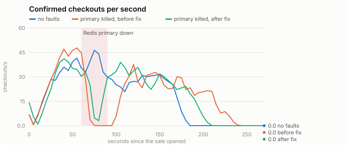
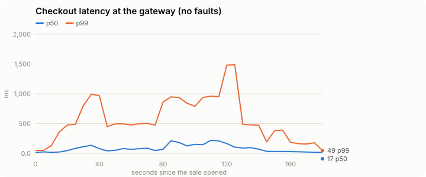
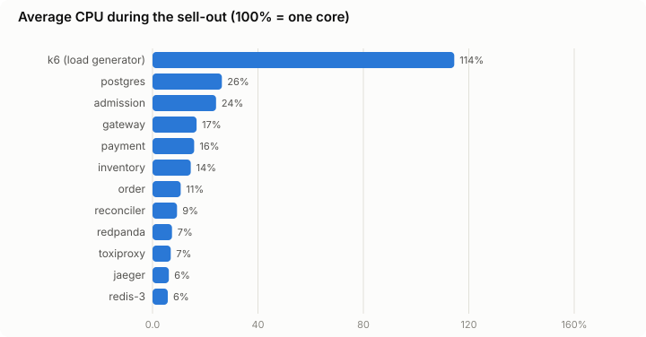
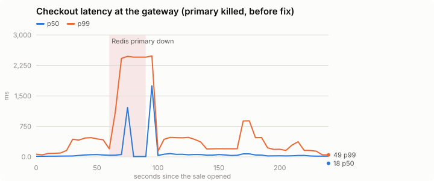
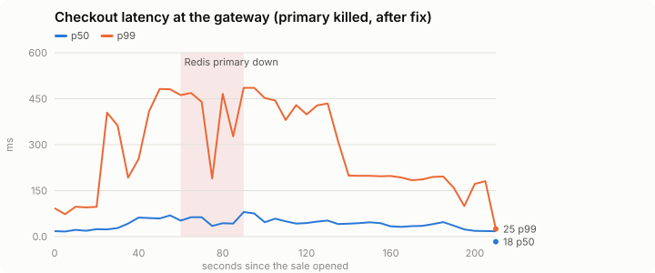

# Week 6: the headline sell-out

**10,000 seats sold out in 174 seconds through the gateway, 0 oversold.**
Then the same sale with a Redis primary killed at peak: before a fix found here, checkout
stalled for ~25 s; after it, the sale kept going through the failover. Every run:
0 seats sold twice, 0 Reconciler violations, Redis and Postgres agreeing on every seat.


## Method

`scripts/headline.py` (`make headline`, `make headline-chaos`), on one 4-vCPU / 16 GB
machine running the whole Compose stack **and** the load generator:

1. **Warm-up**: 60 s of buyers on a throwaway event. A cold JVM (OpenTelemetry agent,
   unwarmed JIT) makes the first minute look ten times slower than steady state
   ([week 5](week5-chaos.md)).
2. **The sale**: a 10,000-seat event (10 sections × 20 rows × 50), production timings
   (payment timeout T = 2 min, pin grace 30 s, hold lease 5 min).
3. **Buyers**: k6 ([`loadtest/buyer.js`](../../loadtest/buyer.js)) ramps to 50 new buyers per
   second over 30 s and holds for 4 min. Each buyer is a fresh anonymous session: waiting
   room, then (like the browser) reads the live seat map over the WebSocket, holds 1-4
   free seats (half the buyers want section A), releases 10 % of the time, otherwise
   checks out with an Idempotency-Key and waits for the order to confirm.
4. **Verification** after every order settles: seats sold = tickets issued = items of
   confirmed orders ≤ capacity; no seat with two tickets; each section's Redis sold set =
   Postgres' sold seats; Reconciler audit 0 violations, 0 errors.

## Results

| | No faults | Primary killed, before fix | Primary killed, after fix |
|---|---:|---:|---:|
| Seats sold | **10,000 / 10,000** | 9,994 | 9,999 |
| Sold out after | **174 s** | — (6 seats under live holds) | — (1 seat under a live hold) |
| Half sold after | 80 s | 115 s | 95 s |
| Confirmed orders | 4,400 | 4,556 | 4,492 |
| Checkout stall during the kill | — | **~25 s at 0 checkouts/s** | **none** (dip, never 0) |
| Peak confirmed checkouts/s | 46 | 48 | 41 |
| Buyers who gave up on checkout | 0 | 3 | 0 |
| Seats with two tickets | **0** | **0** | **0** |
| Reconciler violations | **0** | **0** | **0** |
| Redis ≠ Postgres (sold seats) | 0 | 0 | 0 |
| Unexpected HTTP statuses | 0 | 0 | 0 |
| Retried checkouts that made a second order | 0 | 0 | 0 |

"Sold out" means every seat sold. In the chaos runs a handful of seats stayed under
live holds when the run ended: holds taken right as the primary died, whose buyers'
checkout or release didn't get through. They go back on sale when their 5-minute lease
ends; nothing was lost or double-sold.



### Latency

Server-side, as the gateway measured checkout (gateway → Order → Inventory gRPC →
Postgres claim → response), 15 s windows, median over the sale:
p50 **71 ms**, p99 **486 ms**.



Client-side (k6), no faults: checkout p50 441 ms, p95
1,338 ms, p99 2,591 ms. The gap to the server-side numbers is the
load generator: k6 runs on the same 4 vCPUs as the 25 services and needs more than one
core for itself (below), so its own event loop queues responses. Treat the client-side
numbers as an upper bound on this box, and the gateway's as the system's.



## What the headline test found: failover that never happened

The first chaos run looked healthy on every correctness check, and the chart showed why
it wasn't: confirmed checkouts fell to **zero for ~25 s**, exactly as long as the killed
primary was down.



The replica never took over. Earlier in the week the Docker daemon had restarted, so
every Redis container came back with a new IP. `redis-cluster-init` re-introduced the
nodes to each other (`CLUSTER MEET`, [PR 6](https://github.com/DAmin05/Surge/pull/6)),
and the cluster reported `cluster_state:ok`, but replicas kept replicating from their
primaries' **old** addresses: `master_link_status:down`. A replica that isn't in sync is
never promoted, so the dead primary's slots (including the waiting room's) stayed down
until the primary came back. The same happens after a host reboot.

Fixes:

- **`redis-cluster-init`** now finds replicas whose link is down and re-points them at
  their primary's current address (`CLUSTER REPLICATE`), then waits until every replica
  is replicating. Measured: killing a primary now promotes its replica in ~9 s.
- **Lettuce clients** (Inventory, Admission) fail fast during a failover instead of
  queueing commands for a dead node: commands are rejected while disconnected, time out
  after 2 s, and topology refresh fires after 2 failed reconnects
  ([ADR 0010](../adr/0010-redis-clients-fail-fast-during-failover.md)). Admission now
  answers 503 `RETRY_LATER` on a Redis failure, like Inventory.

After both:



Checkouts dip while the replica is promoted and never stop; no buyer gave up.

## Reproduce

```bash
RATE_LIMIT_IP_PER_SEC=100000 WS_CONNECT_PER_IP_PER_SEC=100000 make up
make headline          # warm-up + 10,000-seat sell-out  -> docs/results/headline/sellout.json
make headline-chaos    # same, Redis primary killed 60 s in -> chaos.json
make charts            # SVGs from the JSON
```

Raw data: [`headline/`](headline/) (per-run JSON: verification, k6 summary, time series).
The k6 load generator shares the machine with the stack, so treat these as the numbers
of one laptop-class box, not a capacity ceiling.
